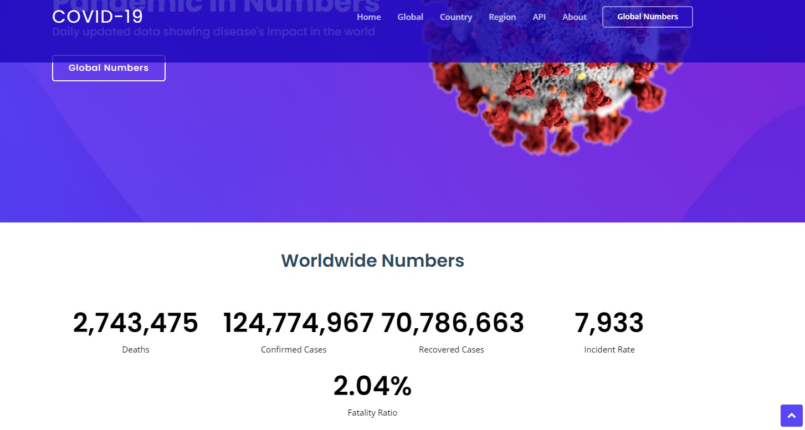

#Covid Real Time

## About

A web application that automatically downloads today's .csv file from the  [JHU CSSE COVID-19  Dataset](https://github.com/CSSEGISandData/COVID-19/tree/master/csse_covid_19_data) with daily covid data (confirmed cases, deaths, recovered, etc.), parses them using Java and saves it to MySql with Hibernate.

The data is then queried using both Spring Data JPA and native SQL queries, added to a model on the back end and displayed using Thymeleaf in the front end.

Finally, with Swagger we can use the full range of API queries.

## Technology

The project uses Java 11, Spring, Hibernate, MySql, HTML, CSS, Bootstrap, Thymeleaf, Swagger, JavaScript and is deployed on Heroku.

## Project in action 

[Project on Heroku](https://boiling-peak-82660.herokuapp.com/) (might take a few minutes to boot up since app goes to sleep after 30 min of inactivity.)

## Meta

Your Name – [@_brunopique_](https://twitter.com/_brunopique_) – hi@brunopique.dev

Distributed under the MIT license.

[https://github.com/brunopique](https://github.com/brunopique/)

## Contributing

1. Fork it (<https://github.com/brunopique/covidRealTime/fork>)
2. Create your feature branch (`git checkout -b feature/fooBar`)
3. Commit your changes (`git commit -am 'Add some fooBar'`)
4. Push to the branch (`git push origin feature/fooBar`)
5. Create a new Pull Request